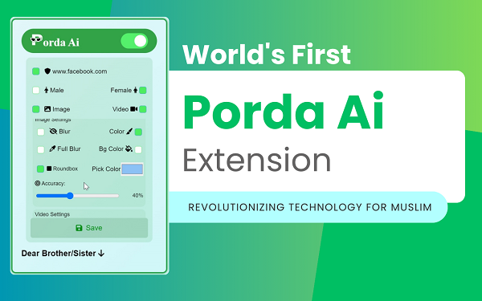
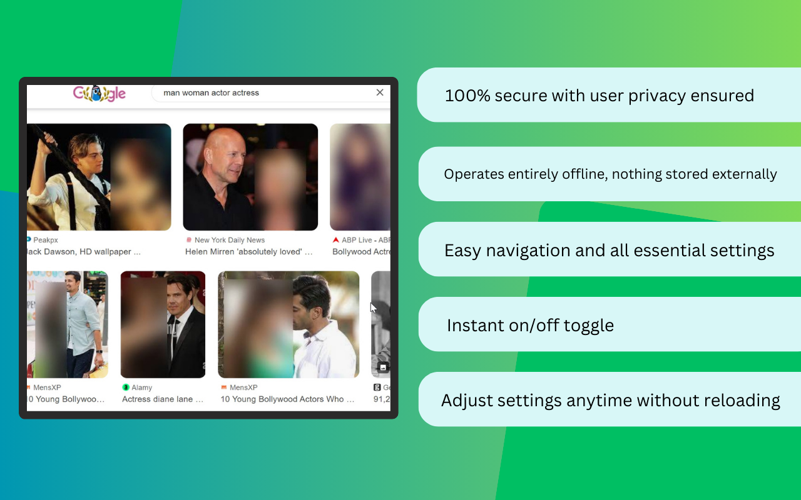
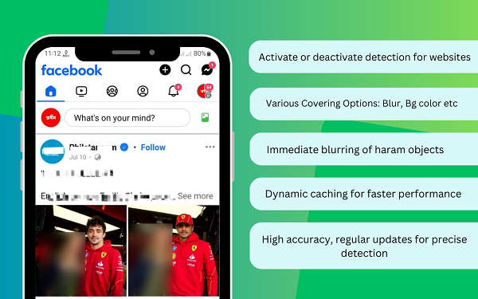
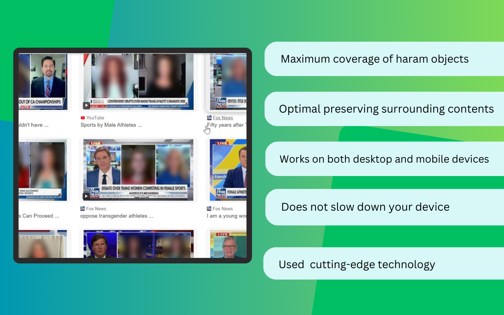

# Welcome to Porda AI!

Introducing **Porda AI**, an innovative application designed to be your everyday AI companion, empowering the Muslim community to maintain modesty in the digital realm by blurring and covering non-mahram and haram objects in your browser.

In today’s digital landscape, encountering haram and non-mahram content in images and videos is a significant challenge. Whether browsing social media, news portals, watching documentaries, or simply surfing the web, non-mahram content can appear unexpectedly. According to Islamic teachings, gazing upon non-mahram content is strictly haram, yet avoiding it can be difficult in the digital age.

By the grace of Allah 💚, we have developed the world’s first advanced AI solution. This cutting-edge technology automatically blurs haram objects in real-time, protecting you and your family from unwelcome content in videos and images.

## Try Porda AI App That Works Directly on Screen

💻 **App version**: [Porda AI on GitHub](https://github.com/hijam-git/Porda-AI)

## Features of Porda AI

💠 **100% Secure:**
- Runs entirely offline; no data is sent or stored externally.
- Ensures user privacy and data security.

💠 **User-Friendly Interface:**
- Intuitive design for easy navigation and settings adjustment.

💠 **Instant On/Off Toggle:**
- Enable or disable the extension without needing to reload the page.

💠 **Dynamic Settings Adjustment:**
- Change settings anytime without requiring a page reload.

💠 **Personalization for Websites:**
- Activate or deactivate detection for specific websites.
- Customizable whitelist/blacklist for sites.

💠 **Separate Settings for Images and Videos:**
- Independent settings for image detection and video detection.
- Customize detection preferences for each type of media.

💠 **Various Covering Options for Your Vision Comfort:**
- Blur, solid color, full blur, and background color (Bg color) for covering haram objects.

💠 **Fast Detection:**
- Detects and blurs haram objects as soon as the image or video is loaded, ensuring a smooth user experience.

💠 **Strong Caching Mechanism:**
- Dynamic and efficient caching for faster performance.

💠 **Optimization for High Accuracy:**
- Advanced AI trained with extensive custom data for precise detection of haram objects.
- Regular updates to improve detection accuracy.

💠 **Optimal Halal Vision:**
- Ensures maximum coverage of haram objects while preserving surrounding content (text, subtitles, etc.).
- Enhances user experience by showing as much of the halal surrounding content as possible.

💠 **Low Resource Consumption:**
- Optimized to run efficiently on both desktop and mobile devices, ensuring it does not slow down your device or impact other tasks.

## Limitations

🔘 Initially, we focused on publishing the project as a Minimum Viable Product (MVP), so there are some limitations.
🔘 We've prioritized detecting common objects first. As a result, the extension may not accurately detect more complex objects.
🔘 The extension works well with images, but video detection may not be perfect for every frame. You can turn off video detection if needed.
🔘 The extension works on most websites, but there are a few where it may not function correctly. Detection can be turned off on those sites.
🔘 For Android, a third-party app (Kiwi) is needed, which may limit functionality. We are actively developing a dedicated version for Android.
🔘 We are actively working to resolve these issues and regularly update the extension to improve its performance.

## Tips

🔆 For the best experience, use the Chrome browser.
🔆 If you don't need detection on a particular website, you can turn off detection for that site in the settings.
🔆 Use the Porda AI app on your computer for direct screen integration on any app.
🔆 For optimal performance, keep the accuracy setting at 40% or lower.
🔆 If it suddenly stops working, simply reload the extension.

## Minimum Requirements

💻 **For Computer:** 8 GB RAM  
📱 **For Android:** 4 GB RAM

## How to Use

1. **For Android:** Install the extension via the Kiwi browser.
2. Download the extension and pin it to your Chrome browser bar.
3. Click the icon, click save, and it is ready to start working.
4. Customize settings as needed and click save to apply them.
5. Manage website blacklist or whitelist as necessary.
6. If video detection is not needed, update settings accordingly.

## Contact Us

Feel free to reach out to us:

- **Email:** [hijamweb@gmail.com](mailto:hijamweb@gmail.com)
- **Facebook:** [Abdullah Holy](https://facebook.com/abdullah.holy)
- **LinkedIn:** [Hijam Ibna Omar](https://www.linkedin.com/in/hijamibnaomar/)
- **Phone (Bkash/Nagad):** 01823170383
- **IBBL Account:** 2050 1806 7001 66103 (Hijam Ibna Omar)
- **Feedback Form:** [Feedback Form](https://forms.gle/uKoWWYATQvLBHhkN9)

Thank you for using Porda AI, and may Allah bless you with protection and guidance in the digital realm.
